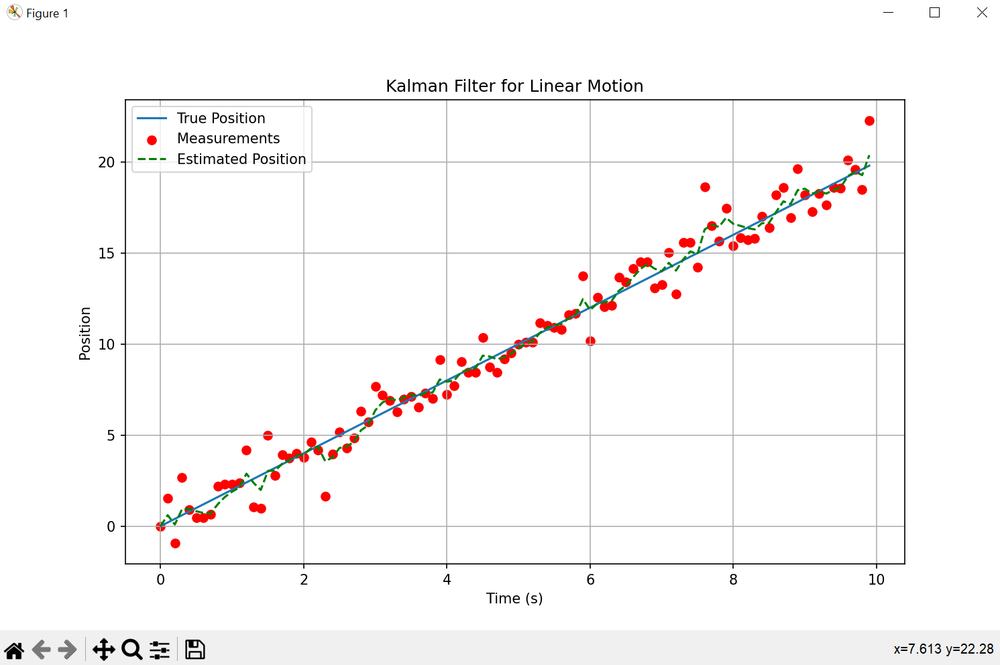

# KalmanFilter
This Python script demonstrates the implementation of a Kalman Filter to estimate the position and velocity of an object undergoing linear motion. The Kalman Filter is a recursive algorithm used for state estimation, combining information from a series of measurements over time with predictions generated by a dynamic model.

The plot shows the true position, noisy measurements, and estimated position over time.

## The Math Behind It
The Kalman Filter is a mathematical method used to estimate the state of a system by combining predictions from a dynamic model with measurements. In the prediction step, we use the system's dynamics to forecast the next state and its uncertainty. This prediction is refined in the update step, where we adjust our estimate based on the difference between the actual and predicted measurements. The Kalman Gain determines how much we trust the measurement versus the prediction, ensuring an optimal balance between the two. By iteratively updating the state estimate and its uncertainty, the Kalman Filter provides an accurate and efficient estimation of the system's state over time.

- Updated Covariance:
Finally, after incorporating the measurement, we update the covariance matrix (Pₖ) to reflect the reduced uncertainty.
Mathematically:
Pₖ = (I - Kₖ * H) * Pₖ

